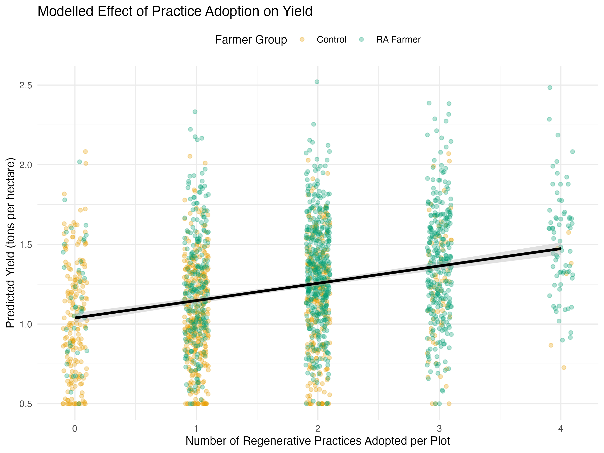

```{r setup, include=FALSE}
library(knitr)
knitr::opts_chunk$set(echo = TRUE,
               out.width = "75%", 
               fig.align = "center", 
               warning = FALSE, 
               message = FALSE) 

library(akima)
library(decisionSupport)
library(ggstance)
library(gtExtras)
library(patchwork)
library(plotly)
library(rPref)
library(svglite)
library(tidyverse)

```

We model a decision impact pathway of  RA VBA  (Whitney et al. 2025). Testing it with field data gathered in Kenya in 2025.


**Conceptual model of RA VBA**

```{r update_data, include=FALSE}

# data <- read.csv("data/inputs_vba_kenya.csv") #original estimates
# # field data
fgd_economic_return_data <- read_csv("data/field_data/RA_Elicitation_FGDs_datamod5.csv")
fgd_practice_scenarios <- read_csv("data/field_data/RA_Elicitation_FGDs_datamod4.csv")

fgd_practice_scenarios$`Lowest Yield in bags/ac` <- as.numeric(fgd_practice_scenarios$`Lowest Yield in bags/ac`)
fgd_practice_scenarios$`Highest Yield in bags/ac` <- as.numeric(fgd_practice_scenarios$`Highest Yield in bags/ac`)

fgd_ra_adoption_estimates <- read_csv("data/field_data/RA_Elicitation_FGDs_datamod3.csv")
fgd_ra_adoption_estimates$`Adoption WITHOUT VBA (%)` <- as.numeric(fgd_ra_adoption_estimates$`Adoption WITHOUT VBA (%)`)
fgd_prob_of_trial <- read_csv("data/field_data/RA_Elicitation_FGDs_data.csv")
# 
# # Update baseline_adoption from fgd_ra_adoption_estimates (Adoption WITHOUT VBA)
# data$lower[data$variable == "baseline_adoption"] <- round(quantile(as.numeric(fgd_ra_adoption_estimates$`Adoption WITHOUT VBA (%)`), 0.1, na.rm = TRUE)/100, 2)
# data$upper[data$variable == "baseline_adoption"] <- round(quantile(as.numeric(fgd_ra_adoption_estimates$`Adoption WITHOUT VBA (%)`), 0.9, na.rm = TRUE)/100, 2)
# 
# # Update vba_effectiveness from fgd_ra_adoption_estimates (difference between with/without VBA)
# vba_effect <- (fgd_ra_adoption_estimates$`Adoption WITH VBA Support (%)` - as.numeric(fgd_ra_adoption_estimates$`Adoption WITHOUT VBA (%)`))/100
# data$lower[data$variable == "vba_effectiveness"] <- round(quantile(vba_effect, 0.1, na.rm = TRUE), 2)
# data$upper[data$variable == "vba_effectiveness"] <- round(quantile(vba_effect, 0.9, na.rm = TRUE), 2)
# 
# # Update base_yield from fgd_practice_scenarios
# data$lower[data$variable == "base_yield"] <- round(quantile(as.numeric(fgd_practice_scenarios$`Baseline (bags/ac)`), 0.1, na.rm = TRUE) * 0.025, 1)
# data$upper[data$variable == "base_yield"] <- round(quantile(as.numeric(fgd_practice_scenarios$`Baseline (bags/ac)`), 0.9, na.rm = TRUE) * 0.025, 1)
# 
# # Update ra_adoption_cost from fgd_economic_return_data (labor + inputs)
# total_cost <- fgd_economic_return_data$`Total  Labour Cost (KSh)` + fgd_economic_return_data$`Total  Inputs Cost (KSh)`
# data$lower[data$variable == "ra_adoption_cost"] <- round(quantile(total_cost, 0.1, na.rm = TRUE), 0)
# data$upper[data$variable == "ra_adoption_cost"] <- round(quantile(total_cost, 0.9, na.rm = TRUE), 0)
# 
# # Update yield_impact_ra from fgd_practice_scenarios (yield improvement)
# yield_improvement <- (as.numeric(fgd_practice_scenarios$`Highest Yield in bags/ac`) - as.numeric(fgd_practice_scenarios$`Baseline (bags/ac)`)) / as.numeric(fgd_practice_scenarios$`Baseline (bags/ac)`)
# data$lower[data$variable == "yield_impact_ra"] <- round(quantile(yield_improvement, 0.1, na.rm = TRUE), 2)
# data$upper[data$variable == "yield_impact_ra"] <- round(quantile(yield_improvement, 0.9, na.rm = TRUE), 2)
# 
# write.csv(data, "data/updated_inputs_vba_kenya.csv", row.names = FALSE)

# Run above and then
# Perform manual adjustment - no negative values for t_norm and posnorm

```

## Data from the field

FGDs were conducted, one in each of in 4 counties (Kitui, Makueni, Embu, Tharaka Nithi). Each FGD was held with 20 individuals.

There were also interviews held to collect in-depth data.

```{r participants_data, include=FALSE}
participants_data <- read.csv("data/field_data/participants_interviews.csv")
```

A total of `r length(participants_data$participant_code)` people were interviewed. 

Counts of interviews held by expert group in each county.

```{r participants_groups}
knitr::kable(participants_data %>% group_by(County,Category) %>%
  tally())
```

Counts of interviews held with men and women in each county. 

```{r participants_gender}
knitr::kable(participants_data %>% group_by(County,Gender) %>%
  tally())
```

### Probability of trial FGDs

This was a more social and behavioral-focused discussion, trying to model the decision-making process of a farmer. It involved rating and discussing different hypothetical farmer profiles. The aim was to understand the key factors that influence a farmer's decision to try a new RA practice for the first time.

```{r, results='asis'}
knitr::kable(summary(fgd_prob_of_trial[c(5,6,8)]))
```

"How often does a farmer need to be in contact with a VBA for it to make a real difference?" (VBA Contact Frequency: e.g., High, Low).

"How influential is it when a farmer sees their neighbors successfully using a practice? If many peers have adopted, does it make you more likely to try?" (Peer Adoption Rate: e.g., Low, Medium, High).

"Does the gender of the farmer influence their willingness to try new things? Let's discuss." (Farmer Gender).

"Considering all these factors together—VBA contact, peer influence, and the farmer's gender—what is the percentage probability (from 0% to 100%) that a farmer in this situation will try the practice?" (Probability of Trial (%)).

```{r}
knitr::kable(fgd_prob_of_trial %>% group_by(`VBA Contact Frequency`) %>% summarize(Mean = mean(`Probability of Trial (%)`, na.rm=TRUE)))
```

### RA adoption estimates FGDs

This was a perception and estimation exercise focused on identifying key adoption barriers (cost, difficulty, time) and quantifying the perceived value-add of the VBA program. The aim was to assess the perceived barriers and likelihood of adoption for different RA practices, with and without the support of a Village Based Advisor (VBA).

```{r, results='asis'}
knitr::kable(summary(fgd_ra_adoption_estimates[6:11]))
```

"Thinking about [RA Practice], how difficult is it to implement on a scale of 1 (easiest) to 5 (hardest)?" (Difficulty (1–5)).

"How would you rate the upfront financial cost? Low, Medium, or High?" (Cost (Low/Med/High)).

"After starting this practice, how long does it take to see a clear benefit or return?" (Time to Benefit (months)).

"Now, imagine a farmer does NOT have support from a VBA. Out of 100 farmers like you, how many would you estimate would try this practice?" (Adoption WITHOUT VBA (%)).

```{r}
knitr::kable(fgd_ra_adoption_estimates %>% group_by(`RA Practice`) %>% summarize(Mean = mean(`Adoption WITHOUT VBA (%)`, na.rm=TRUE)))
```

"Now, imagine the same farmer has regular support, training, and follow-up from a VBA. Out of 100 farmers, how many would try it then?" (Adoption WITH VBA Support (%)).

```{r}
knitr::kable(fgd_ra_adoption_estimates %>% group_by(`RA Practice`) %>% summarize(MeanVBA = mean(`Adoption WITH VBA Support (%)`, na.rm=TRUE)))
```

### Practice scenarios FGDs

Practice scenarios were based on a structured elicitation where the same five scenarios were presented to all participants, and each provided their own yield estimates based on their experience and knowledge.

```{r, results='asis'}
knitr::kable(summary(fgd_practice_scenarios[c(7,8,15,16)]))
```

*Scenario Descriptions & Results*

```{r, scenario_descriptions, echo=FALSE}
library(dplyr)
library(knitr)

# Clean the data - convert yield columns to numeric, handling text entries
fgd_practice_scenarios_clean <- fgd_practice_scenarios %>%
  mutate(
    `Lowest Yield in bags/ac` = as.numeric(`Lowest Yield in bags/ac`),
    `Highest Yield in bags/ac` = as.numeric(`Highest Yield in bags/ac`)
  ) %>%
  filter(!is.na(`Lowest Yield in bags/ac`), !is.na(`Highest Yield in bags/ac`))

# Summarize scenario definitions and results
scenario_summary <- fgd_practice_scenarios_clean %>%
  group_by(`Scenario Name`, Weather, Soil, Management, `Practice 1`, `Practice 2`, `Practice 3`) %>%
  summarise(
    Count = n(),
    Avg_Baseline = mean(`Baseline (bags/ac)`, na.rm = TRUE),
    Avg_Lowest_Yield = mean(`Lowest Yield in bags/ac`, na.rm = TRUE),
    Avg_Highest_Yield = mean(`Highest Yield in bags/ac`, na.rm = TRUE),
    .groups = 'drop'
  ) %>%
  arrange(`Scenario Name`)

# Display the scenario definitions and average results
kable(scenario_summary, caption = "Scenario Definitions and Average Yield Estimates")
```

SCENARIO A: Average rainfall (500-600mm), Medium soil, Strong management. RA practices include Ripping + Manure application (5 t/ac) + Microdosing fertilizer. The results were Baseline ~8 bags/ac, with yields ranging from `r round(mean(scenario_summary$Avg_Lowest_Yield[1]), 1)` to `r round(mean(scenario_summary$Avg_Highest_Yield[1]), 1)` bags/ac on average

SCENARIO B: Drought (300mm), Poor soil, Average management. RA Practices include Mulching only. The results were Baseline ~8 bags/ac, with yields ranging from `r round(mean(scenario_summary$Avg_Lowest_Yield[2]), 1)` to `r round(mean(scenario_summary$Avg_Highest_Yield[2]), 1)` bags/ac on average

SCENARIO C: Good rainfall (700mm), Good soil, Average management. the RA Practices were Intercropping + Mulching + Manure application (5 t/ac). The results were Baseline ~6 bags/ac, with yields ranging from `r round(mean(scenario_summary$Avg_Lowest_Yield[3]), 1)` to `r round(mean(scenario_summary$Avg_Highest_Yield[3]), 1)` bags/ac on average

SCENARIO D: Average rainfall (500-600mm), Poor soil, Weak management. The RA Practices were Planting basins only. The results were Baseline ~10 bags/ac, with yields ranging from `r round(mean(scenario_summary$Avg_Lowest_Yield[4]), 1)` to `r round(mean(scenario_summary$Avg_Highest_Yield[4]), 1)` bags/ac on average.

SCENARIO E: Average rainfall (500-600mm), Medium soil, Strong management. The RA Practices were Agroforestry (trees on farm) + Crop rotation. The results were Baseline ~8 bags/ac, with yields ranging from `r round(mean(scenario_summary$Avg_Lowest_Yield[5]), 1)` to `r round(mean(scenario_summary$Avg_Highest_Yield[5]), 1)` bags/ac on average

The data shows that participants perceived SCENARIO A (intensive package under average conditions) and SCENARIO C (diversification under good conditions) as having the highest potential yields, while SCENARIO B (drought conditions) and SCENARIO D (poor soil with basic practices) were seen as most challenging.

The wide ranges in responses (visible in the original data) reflect the diversity of participant experiences and highlight the context-dependent nature of RA practice outcomes.

### Economic returns FDGs

FGD questions on the economic returns a detailed, participatory costing exercise where farmers built a cost model for each practice from the ground up. The aim was to understand the detailed costs (both labor and inputs) associated with specific Regenerative Agriculture (RA) practices.

```{r, results = "asis"}
knitr::kable(summary(fgd_economic_return_data[c(10,15,19)]))
```

RA Practice / Activity "Let's list the most common RA practices you know or use." 

```{r, results = "asis"}
knitr::kable(table(fgd_economic_return_data$`RA Practice / Activity`))
```

"For [e.g., Composting], what are the specific steps or tasks involved?" (This helps break down the activity for costing).

"For each task, what unit do you measure it in? (e.g., days, acres, piles)" (Type of Unit).

"How many of these units are typically required per acre per season?" (Num.of .Units).

"How many person-days of labor does this task take per unit?" (Num.of .Days).

"If you were to hire labor for this, what would be the daily rate?" (Used to calculate Total Labour Cost (KSh)).

"What specific inputs are required for this practice? (e.g., manure, seeds, mulch)" (Input Type).

"What unit is that input measured in? (e.g., tons, bags, kg)" (Type of Unit-inputs).

"How many units are needed per acre?" (No.of. Units-inputs).

"What is the current market cost per unit of this input?" (Cost/Unit-inputs).

"So, what is the total cost for this input for this practice?" (Total Cost for Input (KSh)).

## Field Data Validation

```{r}
fgd_ra_adoption_estimates$`Adoption WITHOUT VBA (%)` <- as.numeric(fgd_ra_adoption_estimates$`Adoption WITHOUT VBA (%)`)
field_stats <- fgd_ra_adoption_estimates %>% 
  summarise(
    avg_adoption_vba = mean(`Adoption WITH VBA Support (%)`, na.rm = TRUE),
    avg_adoption_no_vba = mean(`Adoption WITHOUT VBA (%)`, na.rm = TRUE),
    vba_impact = avg_adoption_vba - avg_adoption_no_vba,
    avg_difficulty = mean(`Difficulty (1–5)`, na.rm = TRUE),
    avg_benefit_months = mean(`Time to Benefit (months)`, na.rm = TRUE)
  )
```

VBA Impact: `r round(field_stats$vba_impact, 1)` % points
Average Difficulty `r round(field_stats$avg_difficulty, 1)` /5
Time to Benefit `r round(field_stats$avg_benefit_months, 1)` months

## Adoption Patterns of Regenerative Agriculture Practices




# Simulation of  RA VBA:

```{r mcsimulation, warning=FALSE, message=FALSE}
# Source our model
source("vba_model_kenya.R")

# ---- 3. RUN THE MONTE CARLO SIMULATION ----
set.seed(42)  # For reproducible results

# Run the simulation 10,000 times

simulation_results <- mcSimulation(
  estimate = estimate_read_csv("data/inputs_vba_kenya.csv"),
  model_function = vba_causal_effect,
  numberOfModelRuns = 1e4, #run 10,000 times
  functionSyntax = "plainNames"
)

```

The Net Present Value (i.e. current value of the future benefits) of the garden decision options. Here we plot the distribution for the VBA and frame the projected NPV. 

```{r plot_dist_public, warning=FALSE, message=FALSE}
source("functions/plot_distributions.R")
plot_distributions(mcSimulation_object = simulation_results, 
                                    vars = "NPV_Comparative",
                   old_names = "NPV_Comparative",
                   new_names = "Gains compared to the baseline",
                                    method = 'smooth_simple_overlay', 
                                    base_size = 7, 
                                    x_axis_name = "Comparative NPV outcomes")
```

The comparative results of the NPV (VBA vs Baseline) show a mean Additional NPV `r round(mean(simulation_results$y[, "NPV_Comparative"]) / 1000, 1)` Kenyan Shillings per hectare (KES/ha). The 90% CI of this distribution was `r round(quantile(simulation_results$y[, "NPV_Comparative"], 0.05) / 1000, 1)` to `r round(quantile(simulation_results$y[, "NPV_Comparative"], 0.95) / 1000, 1)` KES/ha. The probability of positive NPV for the 25 year distribution is `r round(mean(simulation_results$y[, "Probability_Positive_NPV"]) * 100, 1)` %. The expected Return on Investment (ROI) `r round(mean(simulation_results$y[, "ROI"]), 2)` KES/ha. 

The adoption and yield impacts of the Intervention show a final RA Adoption - in the baseline `r round(mean(simulation_results$y[, "Final_Adoption_Baseline"]), 1)`%. The final RA Adoption with VBA was `r round(mean(simulation_results$y[, "Final_Adoption_VBA"]), 1)`%. The Average Yield Increase `r round(mean(simulation_results$y[, "Yield_Increase"]), 2)` tons/ha/year.