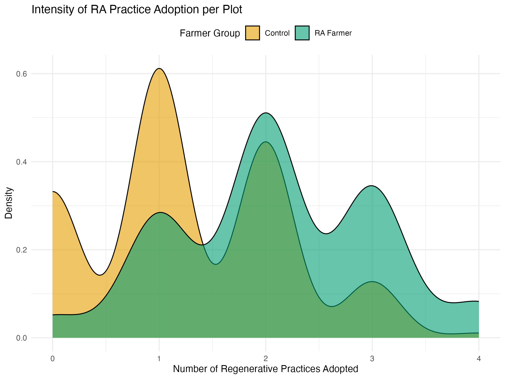

```{r setup, include=FALSE}
library(knitr)
knitr::opts_chunk$set(echo = TRUE,
               out.width = "75%", 
               fig.align = "center", 
               warning = FALSE, 
               message = FALSE) 

library(akima)
library(decisionSupport)
library(ggstance)
library(gtExtras)
library(patchwork)
library(plotly)
library(rPref)
library(svglite)
library(tidyverse)

```

We model a decision impact pathway of  RA VBA  (Whitney et al. 2025). 


**Conceptual model of RA VBA**

# Simulation of  RA VBA:

```{r mcsimulation, warning=FALSE, message=FALSE}
# Source our model
source("vba_model_kenya.R")

# ---- 3. RUN THE MONTE CARLO SIMULATION ----
set.seed(42)  # For reproducible results

# Run the simulation 10,000 times

simulation_results <- mcSimulation(
  estimate = estimate_read_csv("data/inputs_vba_kenya.csv"),
  model_function = vba_causal_effect,
  numberOfModelRuns = 1e4, #run 10,000 times
  functionSyntax = "plainNames"
)

```

The Net Present Value (i.e. current value of the future benefits) of the garden decision options. Here we plot the distribution for the VBA and frame the projected NPV. 

```{r plot_dist_public, warning=FALSE, message=FALSE}
source("functions/plot_distributions.R")
plot_distributions(mcSimulation_object = simulation_results, 
                                    vars = "NPV_Comparative",
                   old_names = "NPV_Comparative",
                   new_names = "Gains compared to the baseline",
                                    method = 'smooth_simple_overlay', 
                                    base_size = 7, 
                                    x_axis_name = "Comparative NPV outcomes")
```

The comparative results of the NPV (VBA vs Baseline) show a mean Additional NPV `r round(mean(simulation_results$y[, "NPV_Comparative"]) / 1000, 1)` Kenyan Shillings per hectare (KES/ha). The 90% CI of this distribution was `r round(quantile(simulation_results$y[, "NPV_Comparative"], 0.05) / 1000, 1)` to `r round(quantile(simulation_results$y[, "NPV_Comparative"], 0.95) / 1000, 1)` KES/ha. The probability of positive NPV for the 25 year distribution is `r round(mean(simulation_results$y[, "Probability_Positive_NPV"]) * 100, 1)` %. The expected Return on Investment (ROI) `r round(mean(simulation_results$y[, "ROI"]), 2)` KES/ha. 

The adoption and yield impacts of the Intervention show a final RA Adoption - in the baseline `r round(mean(simulation_results$y[, "Final_Adoption_Baseline"]), 1)`%. The final RA Adoption with VBA was `r round(mean(simulation_results$y[, "Final_Adoption_VBA"]), 1)`%. The Average Yield Increase `r round(mean(simulation_results$y[, "Yield_Increase"]), 2)` tons/ha/year.

## Data from the field

FGDs were conducted in 4 counties (Kitui, Makueni, Embu, Tharaka Nithi) with 20 individuals (5 Kitui, 3 Makueni, 9 Embu, 4 Tharaka Nithi)

```{r, results='asis'}
 data_2 <- read_csv("data/field_data/RA_Elicitation_FGDs_data.csv")
knitr::kable(summary(data_2[c(5,6,8)]))
```


```{r, results='asis'}
 data_3 <- read_csv("data/field_data/RA_Elicitation_FGDs_datamod3.csv")
knitr::kable(summary(data_3[6:11]))
```

```{r, results='asis'}
 data_4 <- read_csv("data/field_data/RA_Elicitation_FGDs_datamod4.csv")
knitr::kable(summary(data_4[c(7,8,15,16)]))
```

```{r, results = "asis"}

 data_5 <- read_csv("data/field_data/RA_Elicitation_FGDs_datamod5.csv")
knitr::kable(summary(data_5[c(10,15,19)]))
```

## Field Data Validation

```{r}
data_3$`Adoption WITHOUT VBA (%)` <- as.numeric(data_3$`Adoption WITHOUT VBA (%)`)
field_stats <- data_3 %>% 
  summarise(
    avg_adoption_vba = mean(`Adoption WITH VBA Support (%)`, na.rm = TRUE),
    avg_adoption_no_vba = mean(`Adoption WITHOUT VBA (%)`, na.rm = TRUE),
    vba_impact = avg_adoption_vba - avg_adoption_no_vba,
    avg_difficulty = mean(`Difficulty (1–5)`, na.rm = TRUE),
    avg_benefit_months = mean(`Time to Benefit (months)`, na.rm = TRUE)
  )
```

VBA Impact: `r round(field_stats$vba_impact, 1)` % points
Average Difficulty `r round(field_stats$avg_difficulty, 1)` /5
Time to Benefit `r round(field_stats$avg_benefit_months, 1)` months

## Adoption Patterns of Regenerative Agriculture Practices




